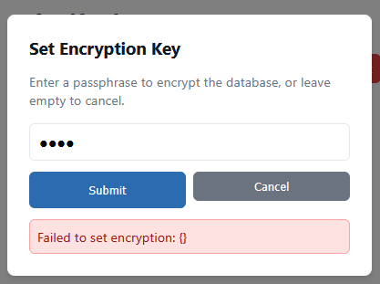
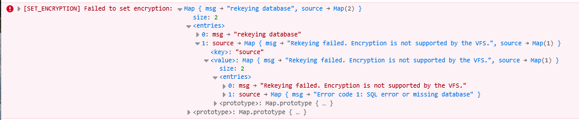

# Ruqslite Experiment

How far can we get writing a TODO application that works both on the command line and the internet, backed by Rusqlite?

## Running the experiment

### Native

```sh
$ cargo run -p cli -- --help
Usage: todo-list [OPTIONS]

Options:
  -p, --db-path <DB_PATH>
          Path to the database

          [default: $HOME/.local/share/todo-list/db.sqlite]

  -l, --log [<LEVEL>]
          Enable logging

          If this flag is set without an explicit level argument, defaults to "info".

          [possible values: trace, debug, info, warn, error]

  -h, --help
          Print help (see a summary with '-h')
```

### WASM

#### Setup

- `rustup target add wasm32-unknown-unknown`
- install `wasm-bindgen-cli`

#### Build

```sh
make serve-spa
```


## Notes and Findings

### WASM/Browser Interop

1. Wasm-bindgen is perfectly happy to call `&mut self` methods on JS objects.
2. Downloading an unencrypted database requires some support in the SPA, but the implementation is straightforward overall.

### Encryption Compatibility

3. Rusqlite has Cargo features for sqlcipher but not for Sqlite3 Multiple Ciphers (sqlite3-mc).
   - Current approach: sqlite3-mc on WASM, sqlcipher on native
   - **Compatibility**: PRAGMA statements for basic SQL operations appear equivalent between the two
   - **Detection method**: Unencrypted databases start with `b"SQLite format 3\0"` in their first 16 bytes
     - Easy to check on native; challenging on WASM where the VFS abstracts file access
     - The `ffi` crate's `Database::is_encrypted()` handles this correctly on WASM

### IndexedDB VFS Encryption Limitations

**Conclusion**: Encryption at rest is not supported by the IndexedDB VFS.

Tested database encryption using sqlite3-mc on WASM:

- **Existing database rekey**: [Testing `PRAGMA rekey`](https://github.com/coriolinus/rusqlite-experiment/commit/04e668518a28c4ce22c574c3adae3925b39b0077) on an existing unencrypted database fails with:
  `"Rekeying failed. Encryption is not supported by the VFS."`

- **Fresh database encryption**: [Testing `PRAGMA key`](https://github.com/coriolinus/rusqlite-experiment/commit/e042d78071616effad3d7479627af8115aedcddd) on a new database fails with:
  `"Setting key failed. Encryption is not supported by the VFS."`

These errors clearly indicate that the IndexedDB VFS does not support encryption, conclusively ruling out encrypted databases when using IndexedDB as the storage layer.


 

### "sahpool" OPFS VFS Encryption

- Works fine unencrypted; should theoretically have better DB perf than the IndexedDB VFS
- A fair amount of serialization/deserialization scaffolding and hassle is necessary at the web worker boundary
- Encryption doesn't "Just Work".
  - Error when executing rekey pragma:
    > Failed to set encryption: rekeying database\
    > Caused by: Rekeying failed. Encryption is not supported by the VFS.\
    > Caused by: Error code 1: SQL error or missing database
  - But that could potentially just be a problem of misinitializing the VFS (see [here](https://utelle.github.io/SQLite3MultipleCiphers/docs/faq/faq_overview/#how-can-i-enable-encryption-for-a-non-default-sqlite-vfs))
- It _is_ possible to manually specify a VFS which can do encryption at rest
  - but right now decryption fails, possible user error
  - also the technique here implies that it may have been possible to get this all working in IndexedDb also; we should reinvestigate (see [`e3d1cc9`](https://github.com/coriolinus/rusqlite-experiment/commit/e3d1cc9972706c59ee9af3af23837d5b86dfbf12))
